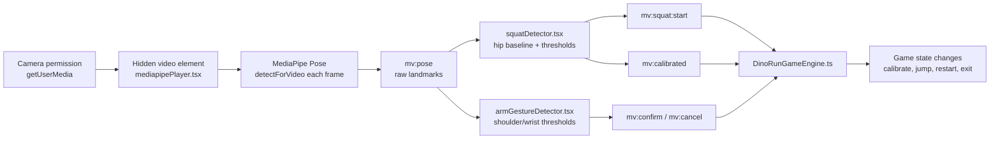

# MediaPipe From Scratch: How a Squat Becomes a Dino Jump

This is a beginner-level walkthrough of MediaPipe, written as if none of it existed
in the project yet. Read this **before** opening the real code
(`src/mediapipe/*.tsx`) — once the concepts below make sense, the actual
implementation is just "the same 5 steps, with real thresholds."

If you want the interview version first, here it is:

- `mediapipePlayer.tsx` owns the hidden camera stream, loads the Pose model, and runs a `requestAnimationFrame` loop.
- Every successful frame produces raw pose landmarks and dispatches `mv:pose`.
- `squatDetector.tsx` and `armGestureDetector.tsx` listen to that raw event, turn body positions into meaning, and emit higher-level events like `mv:squat:start`, `mv:confirm`, and `mv:cancel`.
- `DinoRunGameEngine.ts` never talks to the camera directly. It only listens to those named events and changes game state.
- Teardown matters because the camera is not one thing: the stream, the animation loop, and the Pose model all have to be stopped explicitly.

## 0. One-screen overview



The key contrast is:

- Raw pose data: "I see these body points on this frame."
- Game meaning: "that frame counts as a squat" or "that frame means confirm."

The repo keeps those two layers separate on purpose.

We'll use one concrete example the whole way through:

> 🏃 Player squats in front of the webcam → 🦖 the Dino in the game jumps.

---

## 1. What actually *is* MediaPipe?

Think of MediaPipe as a **pre-trained skeleton-tracking service that runs
entirely in the browser.**

You do **not**:
- train a model
- know anything about neural networks
- send video anywhere over the network

You **do**:
- hand it one video frame
- get back a list of body coordinates ("landmarks") — shoulders, wrists, hips, knees, etc.

```
📷 one video frame  ──▶  🧠 MediaPipe Pose model  ──▶  📍 33 (x, y, z, confidence) points
```

That's the entire contract. Everything else in this doc — "is that a squat?",
"did they raise their right arm?" — is **code we write ourselves**, looking at
those 33 points. MediaPipe never knows what a squat is. It only ever hands you dots.

---

## 2. The big picture (squat → jump), before any code

```
 ┌───────────┐     ┌────────────────┐     ┌───────────────┐     ┌────────────────┐
 │ 📷 Camera │ ──▶ │ 🧠 Pose Model   │ ──▶ │ 🕵️ Squat Logic │ ──▶ │ 🦖 Dino Game    │
 │  raw video │     │ gives landmarks │     │ "was that a    │     │  reacts: jump!  │
 │            │     │  33 body points │     │  squat? yes/no"│     │                │
 └───────────┘     └────────────────┘     └───────────────┘     └────────────────┘
```

Four boxes, four jobs:

| Box | Job | Knows about squats? | Knows about the game? |
|---|---|---|---|
| 📷 Camera | capture raw pixels | ❌ | ❌ |
| 🧠 Pose Model | pixels → 33 landmark points | ❌ | ❌ |
| 🕵️ Squat Logic | landmarks → "squat happened" | ✅ | ❌ |
| 🦖 Game | reacts to "squat happened" | ❌ | ✅ |

Nobody in this chain knows more than they need to. That separation is the whole
trick — keep it in mind, we'll come back to it in step 5.

---

## 3. Building it from an empty project, step by step

### Step 1 — Install the package 📦

```bash
npm install @mediapipe/tasks-vision
```

This gives you the pose-tracking model and the JS/WASM code that runs it —
nothing project-specific yet.

### Step 2 — Get a live video feed 🎥

Before MediaPipe can do anything, you need frames to feed it. In the browser
that means asking for camera permission and attaching the stream to a
`<video>` element:

```ts
const stream = await navigator.mediaDevices.getUserMedia({ video: true });
videoEl.srcObject = stream;
```

At this point you have a live camera feed on the page and **zero** AI involved yet.

### Step 3 — Load the Pose model 🧠

```ts
const vision = await FilesetResolver.forVisionTasks(/* wasm files */);
const poseLandmarker = await PoseLandmarker.createFromOptions(vision, {
  baseOptions: { modelAssetPath: /* the .task model file */ },
  runningMode: "VIDEO",
});
```

This downloads/loads the pre-trained model once. Think of it like loading a
big lookup table into memory — slow-ish the first time, then ready to use
repeatedly.

### Step 4 — Ask it to detect, every frame, in a loop 🔁

Video is just ~30-60 still images per second. So you loop, and on every frame
ask the model "what do you see right now?":

```ts
function loop() {
  const now = performance.now();
  const result = poseLandmarker.detectForVideo(videoEl, now);
  // result.landmarks[0] = 33 points for the one detected person
  requestAnimationFrame(loop); // do it again next frame
}
```

`requestAnimationFrame` just means "run this again right before the next
screen repaint" — the browser's standard way to do smooth, continuous work.

At this point: **you have a live stream of skeleton points, forever, doing
nothing with them yet.**

### Step 5 — Broadcast the raw points, don't hand them out directly 📡

This is the one non-obvious design decision. Instead of the camera/model code
directly calling "squat detector code" and "game code" itself, it just shouts
the data into the page:

```ts
window.dispatchEvent(new CustomEvent("pose-detected", { detail: result.landmarks[0] }));
```

```
 🧠 Model loop
     │
     │  "here's this frame's landmarks, I don't care who's listening"
     ▼
 📡 window (CustomEvent)
     │
     ├──▶ 🕵️ Squat Logic  (listening for "pose-detected")
     └──▶ 🙋 Arm-gesture Logic  (listening for "pose-detected", totally independent)
```

**Why bother?** Because now the camera/model code never needs to know squats
or arm-raises or Dino games exist. You could add a third listener next month
(a push-up detector, say) without touching this file at all. This is the same
idea as an event bus / pub-sub — one broadcaster, any number of independent
listeners.

### Step 6 — Turn "points" into "a squat happened" 🕵️

This is where domain logic finally shows up — MediaPipe never had an opinion
here. A squat, roughly: **the hip point moves down, then back up, past some
threshold, within some amount of time.**

```
        standing               squatting               standing again
     hip.y ≈ 0.55           hip.y ≈ 0.75 (lower!)        hip.y ≈ 0.55
        🧍                        🧎                          🧍
         │                         │                            │
         └────────── down ────────┴─────────── up ──────────────┘
                                     ▲
                         if this dip is big enough → "squat!"
```

(Remember: MediaPipe's `y` grows *downward*, so "lower on screen" = *bigger* y.)

In code, that's just watching one number over time:

```ts
window.addEventListener("pose-detected", (e) => {
  const hipY = e.detail[HIP_INDEX].y;
  // compare hipY against a remembered "standing" baseline
  // if it dipped past a threshold and came back up → dispatch a squat event
});
```

### Step 7 — Announce the *meaningful* event, not the raw one 📣

Same broadcasting trick as step 5, but now with a name that means something:

```ts
window.dispatchEvent(new CustomEvent("squat-detected"));
```

Now anything in the app — a rep counter, the game, a debug logger — can listen
for `"squat-detected"` and never has to know what a "hip landmark" even is.

### Step 8 — The game reacts, without knowing MediaPipe exists 🦖

```ts
window.addEventListener("squat-detected", () => {
  dino.jump();
});
```

That's it. The game engine's code doesn't import MediaPipe, doesn't know
about cameras, doesn't know about landmarks. It just knows "when this named
event fires, jump" — the exact same handler shape it would use for a
keyboard press.

---

## 4. Full loop, now that all 8 steps exist

```
📷 Camera            🧠 Pose Model         📡 "pose-detected"        🕵️ Squat Logic        📣 "squat-detected"       🦖 Game
   │ frame               │ 33 points            │ broadcast              │ watch hip.y            │ broadcast               │
   └──────────────────▶  └──────────────────▶   └──────────────────▶     └──────────────────▶      └──────────────────▶      jump()
        (30-60x / sec, forever, via requestAnimationFrame)
```

Two "broadcast" hops, on purpose — one raw (`pose-detected`), one meaningful
(`squat-detected`) — so every stage only ever knows the one thing it's
responsible for.

## 4.1. How it is actually wired in this repo

This is the practical version of the flow above, using the real files:

1. `useMediaPipe({ enabled })` is the React hook that starts everything when the page wants MediaPipe.
2. `initMediaPipe()` in `src/mediapipe/mediapipePlayer.tsx` creates a hidden `<video>`, asks for the camera with `getUserMedia`, loads the WASM runtime and Pose model, then starts the frame loop.
3. On each animation frame, `detectForVideo(video, performance.now())` runs once and returns the current landmarks.
4. If at least one person is found, the code draws the skeleton to `#mediapipe-canvas` and dispatches `mv:pose` with the raw landmark arrays.
5. `initSquatDetector()` listens for `mv:pose`, waits for a standing calibration window, then emits `mv:calibrated` and later `mv:squat:start` when the hips stay low long enough.
6. `initArmGestureDetector()` listens for the same `mv:pose` event, checks wrist height relative to shoulders, and emits `mv:confirm` or `mv:cancel`.
7. `DinoRunGameEngine.ts` listens for those named events and maps them to state changes: confirm starts calibration or restarts after end, squat triggers a jump while active, cancel exits from the result screens.

## 4.2. Rate, latency, and when it stops

- It does not scan "once per second". The loop is driven by `requestAnimationFrame`, so it runs roughly with the browser repaint rate, usually about 60 times per second, though the actual model calls can be slower depending on device performance.
- The pose model is run once per animation frame, not in a separate interval timer.
- There is a small real-world lag from camera capture, model inference, and the confirm-frame/cooldown logic in the detectors. The detectors intentionally wait for several stable frames so a single noisy frame does not fire a squat or gesture.
- The MediaPipe pipeline stops when the owning React effect cleans up: `useMediaPipe()` calls `stopSquatDetector()`, `stopArmGestureDetector()`, and `stopMediaPipe()` on unmount.
- `stopMediaPipe()` cancels the animation frame, stops all `MediaStream` tracks, closes the Pose landmarker, and removes the hidden video element.
- The visible preview camera on `Exercise.tsx` is separate from the hidden detection stream, so both need their own teardown.

---

## 5. One gotcha worth knowing up front: false triggers

A single noisy/jittery frame could momentarily look like a squat even when
the player is just shifting weight. Real implementations guard against this
with two extra ideas layered on top of step 6-7:

- **Hold it for a few frames in a row**, not just one, before believing it.
- **Cooldown** — after firing once, ignore new detections for a short window,
  so one squat can't accidentally fire twice.

You'll see both of these as small constants (frame counts / millisecond
timers) once we look at the real detector code — they're not new concepts,
just "step 6, made less twitchy."

## 5.1. Why there are really two cameras, not one

It's tempting to assume "the hidden video feeds the model, the visible
skeleton view is the other camera" — that's not quite it. The visible
skeleton view **is not its own camera at all**. Tracing the actual flow in
`Exercise.tsx`:

1. Clicking "Open Camera" runs `openCamera()`, which calls `getUserMedia()`
   itself — **stream #1** — and attaches it to `videoRef`, feeding
   `MotionCard`'s own `<video>` element. It also flips `isCameraOpen` to
   `true`, which swaps in `<canvas id="mediapipe-canvas">`, positioned
   **directly on top of** that video (`position: absolute; inset: 0`, same
   size).
2. That same click also flips `cameraEnabled` to `true`, which is what
   actually starts `useMediaPipe({ enabled: cameraEnabled })` — and that
   runs `initMediaPipe()` in `mediapipePlayer.tsx`, which does its **own,
   separate** `getUserMedia()` call — **stream #2** — into its own hidden
   `<video>` element (Section 3).

```
 "Open Camera" click
        │
        ├──▶ openCamera() ──▶ getUserMedia() ──▶ stream #1 ──▶ videoRef
        │                                                        │
        │                                          (feeds MotionCard's own
        │                                           <video>, immediately
        │                                           hidden behind the canvas)
        │
        └──▶ setCameraEnabled(true) ──▶ useMediaPipe's effect fires
                     │
                     └──▶ initMediaPipe() ──▶ getUserMedia() ──▶ stream #2
                                                    │
                                          hidden <video>, feeds detectForVideo()
                                          AND gets drawn onto #mediapipe-canvas
                                          (which sits ON TOP of stream #1's video)
```

The skeleton view you actually see is `#mediapipe-canvas`, repainted every
frame from **stream #2** (`ctx.drawImage(video, ...)` in `processFrame()`,
then the skeleton drawn on top of that). One camera does double duty:
feeding the pose model *and* being what's painted onto the canvas.

**Stream #1 is the genuinely redundant one.** It plays the whole time, but
since the canvas sits directly on top of it and repaints an opaque frame
every tick, stream #1's own picture is never actually visible once the
canvas appears — it's running hardware, decoding frames, for a `<video>`
element nobody can see. Its only real jobs are triggering the initial
camera-permission prompt and confirming the hardware works before
`mediapipePlayer.tsx` opens its own, second, separate stream.

This wasn't two cameras designed to work together on purpose — it's two
independent `getUserMedia()` calls that happen to point at the same
physical camera, each with its own separate lifetime, doing overlapping
work. Which is exactly why the earlier cleanup bug needed **two separate
fixes**, not one — stopping stream #2 (in `mediapipePlayer.tsx`) had zero
effect on stream #1 (in `Exercise.tsx`), because neither file has any idea
the other one also opened a camera.

## 5.2. The actual old code, before the fix

Pulled from git history (commit `0124b21`, *"fix: stop camera and pose
resources when navigating away"*) — not a re-creation:

```ts
// mediapipePlayer.tsx — BEFORE
let currentVideo: HTMLVideoElement | null = null;
export function getVideoElement(): HTMLVideoElement | null {
  return currentVideo;
}
// no currentStream, no currentPoseLandmarker, no rafId — nothing else
// was ever kept reachable outside initMediaPipe()'s own function body

export async function initMediaPipe(...) {
  // ...
  const stream = await navigator.mediaDevices.getUserMedia({...});
  // `stream` is a local const here — never assigned to anything outside
  // this function. Once initMediaPipe() finishes running, nothing else
  // can ever reach this specific stream object again.
  video.srcObject = stream;
  video.play();
  currentVideo = video; // only the <video> element was kept, and only
                         // for the unrelated getVideoElement() getter above
  // ...
  requestAnimationFrame(processFrame); // return value thrown away — no
                                        // way to ever cancelAnimationFrame() this
}
// stopMediaPipe() did not exist at all
```

```ts
// useMediaPipe.tsx — BEFORE
return () => {
  window.removeEventListener("mv:mediapipe-ready", onReady);
  window.removeEventListener("mv:calibrated", onCalibrated);
  window.removeEventListener("mv:jump", onJump);
  window.removeEventListener("mv:squat:start", onSquat);
  window.removeEventListener("mv:squat:end", onSquatEnd);
  // this cleanup DID run correctly on unmount — it just never touched
  // the camera, model, or frame loop, because there was nothing exposed
  // to call
};
```

```ts
// Exercise.tsx — BEFORE
const openCamera = async () => {
  const stream = await navigator.mediaDevices.getUserMedia({ video: true });
  // stream isn't stored anywhere outside this function either
  if (videoRef.current) {
    videoRef.current.srcObject = stream;
    setIsCameraOpen(true);
  }
};
// no streamRef, no cleanup effect for this stream at all
```

Two things were missing at once, not just one: nothing was *storing* these
values anywhere a cleanup function could reach — and separately, no cleanup
function existed to use them even if they had been stored. The real fix
(Section 8, Step 9) had to add both together, in both files independently,
since neither file knew the other one also owned a camera stream.

---

## 6. Where this maps in the real project (for later)

Once the concepts above feel solid, here's the same 8 steps mapped to real
files — useful as a reference, not something to read line-by-line yet:

| Step | Real file |
|---|---|
| 2-4: camera + model + loop | `src/mediapipe/mediapipePlayer.tsx` |
| 5: raw landmark broadcast | `src/mediapipe/mediapipePlayer.tsx` → `"mv:pose"` event |
| 6-7: squat interpretation + meaningful event | `src/mediapipe/squatDetector.tsx` → `"mv:squat:start"` |
| 6-7: arm-raise interpretation (confirm/cancel) | `src/mediapipe/armGestureDetector.tsx` → `"mv:confirm"` / `"mv:cancel"` |
| 8: game reacting | `src/engine/DinoRunGameEngine.ts` |

See [docs/lesson-log.md § "MediaPipe and the game are decoupled through
events, not imports"](./lesson-log.md) for the deeper dive once you're ready
for real code.

---

## 7. A quick primer: `dispatchEvent` and `addEventListener`

Before the line-by-line walkthrough below, it's worth being solid on this,
since the entire pipeline is built on it.

**A native event, like `click`:** the *browser* dispatches it for you. You
never call `dispatchEvent` yourself. It fires at the exact element you
clicked, then **bubbles up** through that element's ancestors — parent →
grandparent → ... → `document` → `window`. That bubbling is *why* listening
at `document` catches clicks from anywhere on the page — not because the
browser broadcasts it everywhere, but because it travels upward past every
ancestor on its way out.

**A custom event, like `"mv:pose"`:** nothing bubbles it into existence.
*We* have to do both halves ourselves, explicitly:

```ts
// Half 1: create it — just builds an Event object, does nothing yet
const event = new CustomEvent("mv:pose", { detail: { poseLandmarks } });

// Half 2: actually fire it — THIS is the moment any listeners get called
window.dispatchEvent(event);
```

And separately, elsewhere, **before** that dispatch ever runs:

```ts
window.addEventListener("mv:pose", (e) => {
  // runs synchronously, every time the line above executes
});
```

**Does dispatching mean the whole page automatically listens? No.**
Dispatching an event does nothing by itself except call whatever functions
are *already registered* for that exact name, on that exact target
(`window`, in this codebase). If nothing had called
`addEventListener("mv:pose", ...)` yet, the `dispatchEvent` call above does
nothing observable — no error, just silence. It's opt-in on **both** ends:
something has to dispatch, and separately something has to have already
subscribed. The only real difference between `click` and `mv:pose` is *who*
does the dispatching — for `click` it's the browser's own internals
(invisible to you); for `mv:pose` it's `mediapipePlayer.tsx`'s own code,
explicitly, on purpose.

One more thing that matters for this repo specifically: **multiple
independent `addEventListener` calls for the same name all fire.** That's
exactly how `squatDetector.tsx` and `armGestureDetector.tsx` both react to
the same `mv:pose` — they each called `addEventListener` separately, neither
knows the other exists, and both get invoked every single time
`mediapipePlayer.tsx` dispatches.

---

## 8. Line-by-line: opening the real files

Same 8 steps as Section 2, now with exact file and line references. Worth
reading with the actual files open side by side.

**Step 1 — the starting point** → `src/mediapipe/useMediaPipe.tsx:23-34`
```ts
useEffect(() => {
  if (!enabled) return;
  initMediaPipe().then(() => {      // ← calls into mediapipePlayer.tsx, Step 2
    initSquatDetector();             // ← squatDetector.tsx, Step 6
    initArmGestureDetector();        // ← armGestureDetector.tsx, Step 7
  });
```
`ExercisePage` renders and calls this hook — everything below only exists
because this `useEffect` ran.

**Step 2 — load the model** → `mediapipePlayer.tsx:52-69`
- Line 52-54: `FilesetResolver.forVisionTasks(...)` — downloads/loads the WASM runtime.
- Line 57-69: `PoseLandmarker.createFromOptions(...)` — loads the pose model onto that runtime.

**Step 3 — open the camera, store the stream** → `mediapipePlayer.tsx:27-30` and `:73-83`
- Line 27-30: `let currentVideo`, `currentStream`, `currentPoseLandmarker`, `rafId` — declared at **module scope** (outside any function). This answers "where is the stream stored" — not in React state, in a plain variable that lives as long as the JS module is loaded.
- Line 73-75: `getUserMedia({ video: { width: 640, height: 480 } })` — the actual camera permission prompt + hardware access.
- Line 81-83: the stream and video element get assigned into those module variables.

**Step 4 — the frame loop** → `mediapipePlayer.tsx:88-131`
- Line 88: `function processFrame()` — the loop body.
- Line 92-94: guards against a duplicate timestamp, then calls `poseLandmarker.detectForVideo(video, now)` — the actual "ask the model what it sees right now" call.
- Line 128: `rafId = requestAnimationFrame(processFrame)` — schedules itself again. Not a `setInterval` — a function that keeps re-booking itself for "right before the next screen repaint," which is what `requestAnimationFrame` means. Roughly 30-60 times a second depending on the display.
- Line 131: the very first call, made once, right after the camera is ready — everything after this is the function calling itself.

**Step 5 — broadcast it** → `mediapipePlayer.tsx:116-125`
```ts
window.dispatchEvent(
  new CustomEvent<MyPoseDetail>("mv:pose", {
    detail: { poseLandmarks: result.landmarks[0], poseWorldLandmarks: ... },
  }),
);
```
The exact `dispatchEvent` call from Section 7. Fires up to 60 times a
second, every frame a person is detected.

**Step 6 — squats listen for it** → `squatDetector.tsx:58-59`
```ts
export function initSquatDetector() {
  window.addEventListener("mv:pose", handlePoseEvent);   // ← the "subscribe" half
```
The logic lives in `onSquatFrame()` at `squatDetector.tsx:90-169` — lines
106-124 handle calibration (averaging 120 frames into `baselineY`), lines
136-168 handle the squat-depth check once calibrated.

**Step 7 — gestures listen for it too, independently** → `armGestureDetector.tsx:26-27`
```ts
export function initArmGestureDetector() {
  window.addEventListener("mv:pose", handlePoseEvent);   // ← a second, separate subscription
```
The math is at `armGestureDetector.tsx:44-52` — reads landmarks 11/12
(shoulders) and 15/16 (wrists) out of the same array `squatDetector.tsx` is
also reading from, just different indices.

**Step 8 — the game listens for the *meaningful* events** → `DinoRunGameEngine.ts:568-571`
```ts
window.addEventListener("mv:squat:start", this._onMvSquat);
window.addEventListener("mv:confirm", this._onMvConfirm);
window.addEventListener("mv:cancel", this._onMvCancel);
window.addEventListener("mv:calibrated", this._onMvCalibrated);
```
This file never listens for `mv:pose` at all — it only cares about the
*named, meaningful* events Steps 6-7 produced. It has no idea landmarks or
thresholds exist.

**Step 9 — stop it all on unmount** → `mediapipePlayer.tsx:32-43` (`stopMediaPipe`),
called from `useMediaPipe.tsx:50-56` (the part of the `useEffect` after
`return () => {` — the cleanup function).

> Line numbers are current as of this writing — if the files have shifted
> since, the function/variable names above are still exact and easy to
> re-locate with a search.
